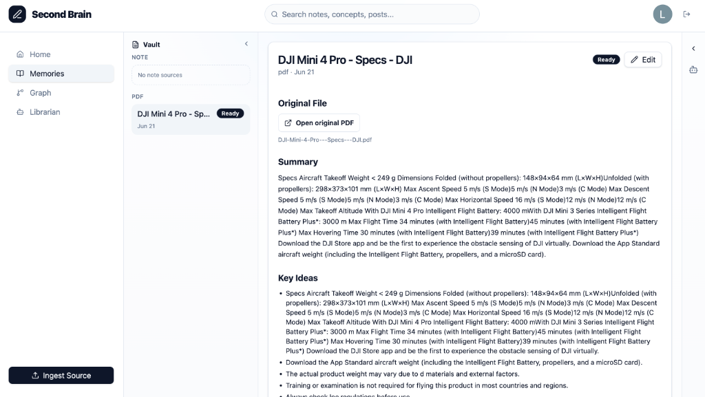
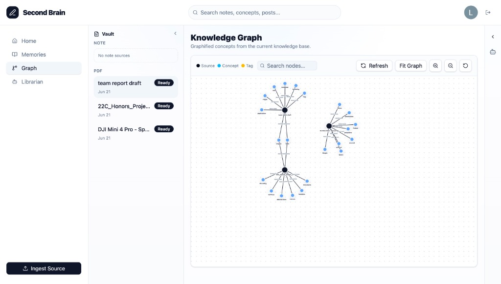
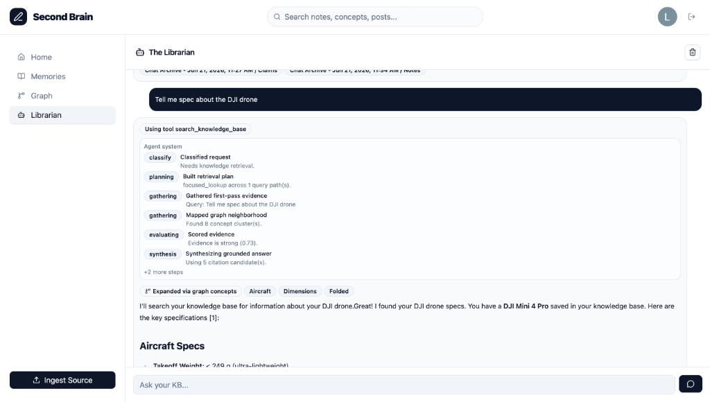

# Second Brain

Second Brain is a personal knowledge-base assistant. It helps users save knowledge from notes, PDFs, and links, then recall it later through search, generated summaries, a knowledge graph, and an agent chat experience.


*Memory Detail View with summary, key ideas, and source file metadata.*


*Interactive Knowledge Graph connecting notes, concepts, and tags.*


*Librarian Agent Chat showing tool executions, retrieved graph concepts, and streaming grounded responses.*

The app uses a FastAPI backend, a React/Vite frontend, Firebase Auth, optional Firestore persistence, Anthropic Claude for enrichment and chat, and OpenAI embeddings when configured.

## Features

- Ingest notes, PDFs, and web links.
- Convert saved material into structured memories with summaries, key ideas, claims, questions, concepts, and tags.
- Build retrieval chunks and a knowledge graph that connects related ideas.
- Chat with an agent that uses saved knowledge, citations, graph context, tool traces, and streaming responses.
- Edit saved memory content and regenerate related artifacts.
- Delete saved memories and their generated artifacts.
- Archive chat sessions back into the knowledge base.
- Store original uploaded files with GitHub.
- Run locally with in-memory demo data or persist data in Firebase Firestore.

## Tech Stack

- Python, FastAPI, Uvicorn
- TypeScript, React, Vite
- Firebase Auth, Firebase Admin SDK, Firestore
- Anthropic Claude API
- OpenAI Embeddings API
- GitHub Contents API
- Tailwind CSS, Radix UI, Vaul, Lucide React
- D3 Force, React Markdown, Remark GFM
- PyPDF, Pillow, HTTPX
- Pytest

## Install

From the project root:

```bash
uv sync
cd frontend
npm install
```

## Environment

Copy the example backend environment file:

```bash
cp .env.example .env
```

The backend can run without AI keys for local development. Without `ANTHROPIC_API_KEY`, ingestion uses local fallback enrichment. Without `OPENAI_API_KEY`, embeddings use deterministic local vectors.

Common backend variables:

```bash
ANTHROPIC_API_KEY="your_claude_key"
OPENAI_API_KEY="your_openai_key"
SECONDBRAIN_STORAGE_BACKEND=memory
SECONDBRAIN_SEED_MOCK_DATA=1
```

Create `frontend/.env` for the Vite app:

```bash
VITE_API_BASE_URL="http://localhost:8000"
VITE_FIREBASE_API_KEY="your-firebase-web-api-key"
VITE_FIREBASE_AUTH_DOMAIN="your-project.firebaseapp.com"
VITE_FIREBASE_PROJECT_ID="your-firebase-project-id"
VITE_FIREBASE_APP_ID="your-firebase-web-app-id"
```

Firebase Auth is used by the frontend for Google sign-in. The backend accepts Firebase ID tokens when present and falls back to the mock account for local demo mode.

## Run

Start the backend from the project root:

```bash
uv run python -m backend.api
```

Equivalent Uvicorn command:

```bash
uv run uvicorn backend.api:app --reload
```

Do not run `uv run api.py` from inside `backend/`; the backend imports expect the project root to be on Python's module path.

In another terminal, start the frontend:

```bash
cd frontend
npm run dev
```

The frontend runs on the Vite URL printed in the terminal and talks to `VITE_API_BASE_URL`, defaulting to `http://127.0.0.1:8000`.

## Storage

The backend defaults to seeded in-memory storage:

```bash
SECONDBRAIN_STORAGE_BACKEND=memory
SECONDBRAIN_SEED_MOCK_DATA=1
```

Use Firestore for persistent accounts, sources, chunks, posts, and graph data:

```bash
SECONDBRAIN_STORAGE_BACKEND=firestore
FIREBASE_PROJECT_ID="your-firebase-project-id"
FIREBASE_SERVICE_ACCOUNT_FILE="/absolute/path/to/service-account.json"
# or:
FIREBASE_SERVICE_ACCOUNT_JSON='{"type":"service_account",...}'
```

For local Firestore emulator development:

```bash
SECONDBRAIN_STORAGE_BACKEND=firestore
FIREBASE_PROJECT_ID="secondbrain-local"
FIRESTORE_EMULATOR_HOST="127.0.0.1:8080"
```

Firestore collections used by the backend are `accounts`, `sources`, `chunks`, `posts`, and `graphs`. Records are scoped by `account_id`.

## Original File Storage

PDF uploads and scraped-link Markdown snapshots are stored outside the database, then linked from source metadata.

Original files are stored in GitHub:

```bash
ORIGINAL_FILE_STORAGE=github
GITHUB_TOKEN="your-github-token"
GITHUB_STORAGE_REPO="owner/repo"
GITHUB_STORAGE_BRANCH="main"
GITHUB_STORAGE_PATH_PREFIX="uploads"
```

GitHub storage requires a token with write access to `GITHUB_STORAGE_REPO`.

## API

- `GET /account`
- `GET /sources`
- `GET /sources/{source_id}`
- `POST /sources`
  - accepts JSON or multipart form data
  - fields: `type=note|pdf|link`, `title`, `text`, `source_url`, `file`
- `PATCH /sources/{source_id}`
  - JSON body: `{ "content": "updated memory content" }`
- `DELETE /sources/{source_id}`
  - deletes the memory and generated source artifacts
- `GET /posts`
- `GET /graph`
- `POST /chat`
  - JSON body: `{ "message": "...", "history": [] }`
- `POST /chat/stream`
  - streams server-sent events for text, tool calls, trace steps, and final citations

## CLI Ingestion

```bash
uv run python -m backend.ingest note --account-id "cli-user" --title "Transformers" --text "Self-attention connects tokens."
uv run python -m backend.ingest pdf --account-id "cli-user" --title "Paper" --file ./paper.pdf
uv run python -m backend.ingest link --account-id "cli-user" --title "Article" --source-url "https://example.com"
```

## Test

Backend tests:

```bash
uv run pytest
```

Frontend typecheck and build:

```bash
cd frontend
npm run build
```

## Documentation

More technical notes are in `documents/`:

- [Agent Workflow](documents/agent_workflow.md)
- [Ingestion Workflow](documents/ingestion_workflow.md)
- [System Architectures](documents/architectures.md)
- [Knowledge Graph](documents/knowledge_graph.md)
